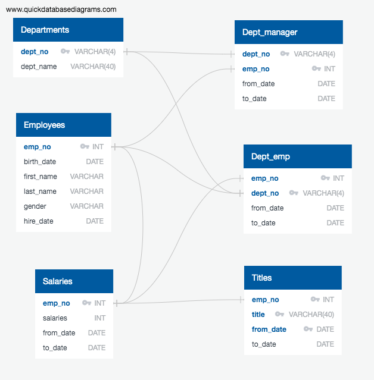
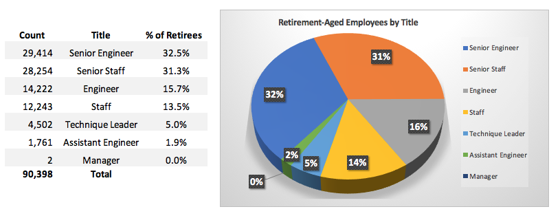
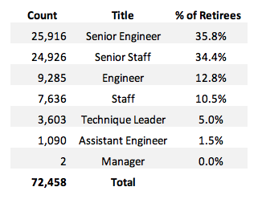
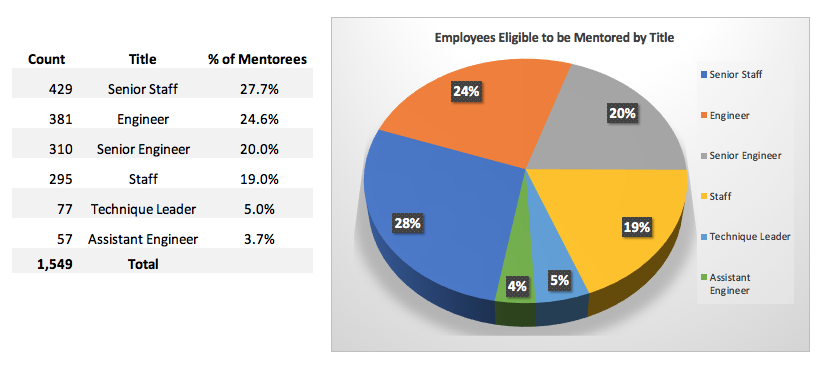
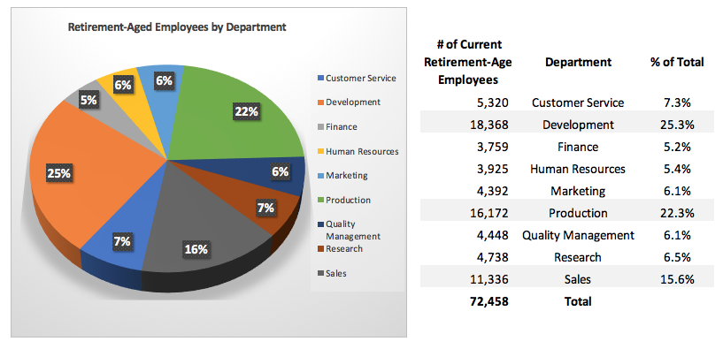
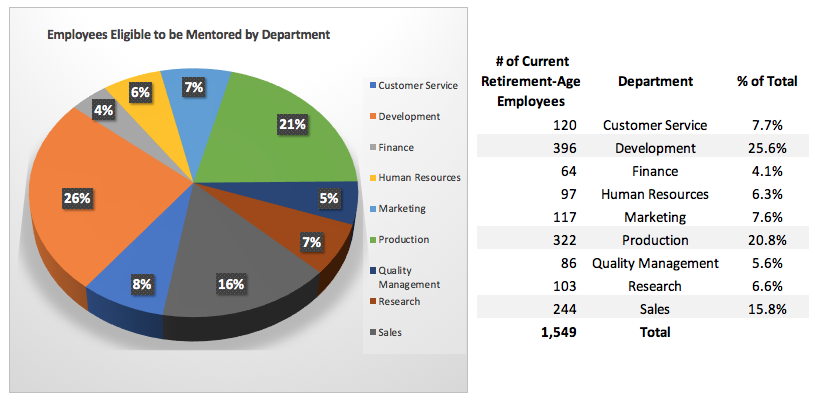
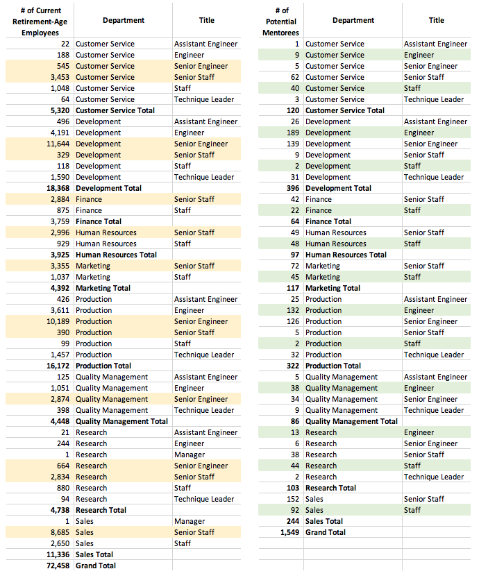
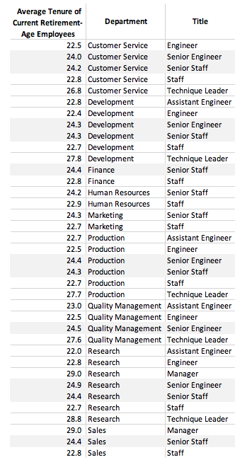

# Pewlett Hackard Human Resource Analysis: *The Silver Tsunami*

## Background
Pewlett Hackard is a large corporation that has been around for decades and as it has grown, so have its vast human resources.  With over 240,124 current employees, Pewlett Hackard has a large portion of its current employees approaching retirement age in the not-so-far-off future.  As such, management would not only like to explore early retirement packages for employees meeting certain criteria but get a handle on which positions will need to be filled as these potential retirees begin to exit the company. 

Always beneficial to promote from within, PH would like to start a mentorship program before these potential retirees leave the company to train the next generation.

##Project Overview
Working with Bobby, an uprising Human Resource Analyst, our team has become very familiar with the data, and the realization that the number of employees eligible for retirement is staggering.  Management would like to continue to explore:

1. the number of retiring employees per title, which will highlight functional areas and grade levels most impacted, and

2. identifying current employees who are eligible to participate in a mentorship program.  A mentorship program is being developed to help the soon-to-be retireed employees to prepare the next generation of Pewlett Hackard employyes to step into their roles. 

What we find will help kickstart the development of this new mentorship program.

### Resources
Raw data provided to the team from Pewlett Hackard's internal systems included 6 csv files, all included in this repository in the **Data folder**:

1. employees.csv  
2. departments.csv  
3. dep_emp   
4. dept_manager.csv    
5. salaries.csv  
6. titles.csv

Below is an Entity Relationship Diagram (ERD), which depicts the conceptual, physical, and logical structure and connections of these original datasets.

The tables were constructed and imported into the database using **PostgreSQL**, as were the queries.

##Results
**Objective 1**  
Looking at the **number of employees that are retirement-eligible based on age**, (i.e. employees born between the dates of **January 1, 1952 and December 31, 1955**), we find the following **break-down by title**:

The above chart is based on the employees.csv file provided; however, it does include employees who are no longer with Pewlett Hackard.  When these terminated employees are stripped out the break down is as follows: 
 

The totals may be smaller when looking at only current employees, however, the numbers are still staggering and the job titles most impacted are still the same, in particular:

* Senior Engineers
* Senior Staff

A mentorship program in these two departments appears to be a great idea!

**Objective 2**  
Our second objective is to identify employees that will be eligible to participate in a mentorship program; defined as current employees with a birthdate between **January 1, 1965 and December 31, 1965**.

A summary of mentor-eligible employees by title:

These **1,549 employees can be found in the mentorship_eligibilty.csv** file located in the Data folder of this repository.

Looking at the broad-strokes, for current employees with birthdates in the year of 1965, there are:

* 295 Staff eligible for the mentorship program, with 24,962 potential Senior Staff retirement-aged employees available to mentor, and 
* 381 Engineers eligible for the mentorship program, with 25,916 potential Senior Engineer qualified to mentor

That's a lot of potential mentors to choose from! Let's drill further down into the specific departments these employees belong to to confirm there is enough potential mentors in each department.

**By Department**  
Taking an alternative look at the data, we can see the breakdown of **retirement-aged employees by department** as follows:

And, the potential mentorees by department: 

##Summary
Pewlett Hackard is facing a large human resource event over the next few years as 30% of all current employees is approaching retirement age.

These **72,458 current potential retirees** involve a total of **7 job titles over 9 departments**.  Pewlett hackard is smart to get prepared.

Below is a side-by-side, detailed breakdown of retirement-aged employees and potential mentorees, it is clear that there are **plenty of retirement-ready employees in each departments to mentor the next generation**. 

Particularly in areas of Development and Production, the number of retirement-aged employees is extremely high for Senior Engineer and Senior Staff positions.  So how should PH decide who to invite to be a mentor?  Let's look at tenure.

After calculating the tenure of the retirees in their current position by updating the **to_date to a current date**, we find all of the professionals in the Senior Staff and Senior Engineer postions have a minimum of **18 years tenure** in their current positions. Furthermore, the average for all the retirement-age eligible positions across all departments is over 20 years!  

A list of retirement-ready employees with their tenure (in years) can be found in the Data folder in this repository, **retiree_tenures.csv**.  

**Mentor Identification**  
We have learned that tenure is not a great qualifier for potential mentors for this Mentorship Program since all the retirement-aged eligible employees are well tenured and experienced.  

Examining additional data such as **performance appraisal data** as well as **work location** would help match up mentors and mentorees more effectively.  

